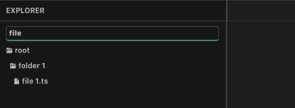
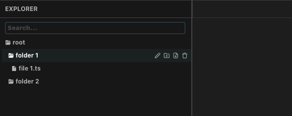
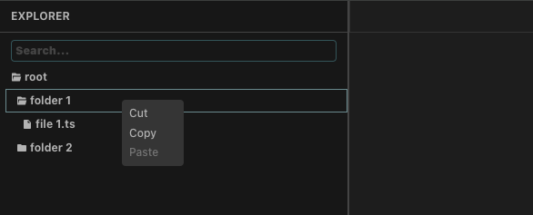
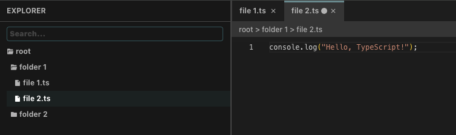

# File Explorer

[Try it out!](https://shuuuuting.github.io/file-explorer/)

## Tech

- React
- Redux
- TypeScript
- Local Storage
- Electron

## Features

- Directories Navigator
- File Editor
- Search / Copy / Cut / Paste / Delete / Rename
- Restore Data with Local Storage 

## Instructions

### Navigation Bar

**- Search Bar**

▶ You can search for folders and files by name



**- Hover Actions**

▶ By hovering, you can rename / create child folder or file / delete



**- Right Click Actions**

▶ By right clicking, you can cut / copy / paste



### Editor Pane

After creating a new file or clicking on an existing one, the corresponding file editor will open.

Press (Ctrl + S) or (Command + S) to save content.

**- Default Content**

▶ Initiate content for txt / json / js / ts / txt file type 




## Run the Web App 

```shell
npm install && npm run start
```

## Run the Electron App 

Run in a seperate terminal
```shell
npm run electron:start
```

## Package the Electron App 

```shell
npm run electron:build
```
